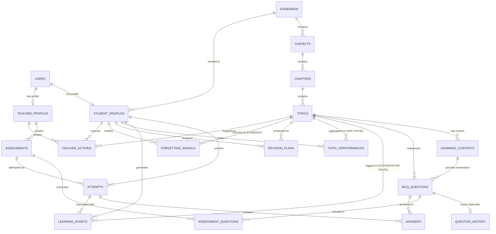

# EduNavika — Database Schema & Entity Relationships

## 1. Overview

EduNavika uses a fully normalized relational schema built with **SQLAlchemy 2.0** and managed via **Alembic** migrations. The design strictly enforces:
- **UUID primary keys** across all tables (UUIDv4) for distributed generation without ID collisions.
- **UTC timestamps** (`created_at`, `updated_at`) across all entities.
- **Database-Level Integrity Constraints**: Explicit `CheckConstraint` and `UniqueConstraint` enforcement across attempts, answers, curriculum, and learning events.
- **Foreign-key integrity** with cascade deletes on hierarchical parent-child relationships and set-null on reference associations.
- **Dual-Database Tier Separation**:
  - **SQLite**: Local development and fast, zero-dependency automated test execution (`StaticPool`, `PRAGMA foreign_keys = ON;`).
  - **PostgreSQL**: Production deployment, high-throughput concurrent logging, and authoritative host of the longitudinal research dataset.

---

## 2. Entity-Relationship Diagram

---

## 3. Entity Specification & Integrity Constraints

### 3.1 Authentication & Profiles

#### `users`
| Column | Type | Nullable | Constraints / Description |
|---|---|---|---|
| `id` | VARCHAR(36) | No | Primary Key (UUIDv4) |
| `name` | VARCHAR(150) | No | User's full name |
| `email` | VARCHAR(255) | No | Unique (`uq_user_email`), Indexed |
| `hashed_password` | VARCHAR(255) | No | Bcrypt hashed secret |
| `role` | VARCHAR(20) | No | Enum: `STUDENT`, `TEACHER`, `ADMIN` |
| `is_active` | BOOLEAN | No | Default `true` |
| `created_at` | TIMESTAMP (UTC) | No | Creation timestamp |
| `updated_at` | TIMESTAMP (UTC) | No | Last update timestamp |

#### `student_profiles`
| Column | Type | Nullable | Constraints / Description |
|---|---|---|---|
| `id` | VARCHAR(36) | No | Primary Key (UUIDv4) |
| `user_id` | VARCHAR(36) | No | Unique FK -> `users.id` (CASCADE) |
| `standard_id` | VARCHAR(36) | Yes | FK -> `standards.id` (SET NULL) |
| `division` | VARCHAR(20) | Yes | Class section / division (e.g. "A") |
| `enrollment_number` | VARCHAR(50) | Yes | School student roll/enrollment identifier |

#### `teacher_profiles`
| Column | Type | Nullable | Constraints / Description |
|---|---|---|---|
| `id` | VARCHAR(36) | No | Primary Key (UUIDv4) |
| `user_id` | VARCHAR(36) | No | Unique FK -> `users.id` (CASCADE) |
| `employee_id` | VARCHAR(50) | Yes | Institutional staff identifier |

---

### 3.2 Curriculum Hierarchy

#### `standards`
| Column | Type | Nullable | Constraints / Description |
|---|---|---|---|
| `id` | VARCHAR(36) | No | Primary Key (UUIDv4) |
| `grade_number` | INTEGER | No | Unique, Indexed. **Check**: `1 <= grade_number <= 12` |
| `name` | VARCHAR(100) | No | e.g. "Standard 10" |
| `description` | TEXT | Yes | |
| `is_active` | BOOLEAN | No | Default `true` |

#### `subjects`
| Column | Type | Nullable | Constraints / Description |
|---|---|---|---|
| `id` | VARCHAR(36) | No | Primary Key (UUIDv4) |
| `standard_id` | VARCHAR(36) | No | FK -> `standards.id` (CASCADE) |
| `name` | VARCHAR(150) | No | e.g. "Science", "Mathematics" |
| `code` | VARCHAR(50) | No | Unique per standard: `uq_subject_standard_code(standard_id, code)` |
| `description` | TEXT | Yes | |
| `is_active` | BOOLEAN | No | Default `true` |

#### `chapters`
| Column | Type | Nullable | Constraints / Description |
|---|---|---|---|
| `id` | VARCHAR(36) | No | Primary Key (UUIDv4) |
| `subject_id` | VARCHAR(36) | No | FK -> `subjects.id` (CASCADE) |
| `chapter_number` | INTEGER | No | Unique: `uq_chapter_subject_order(subject_id, chapter_number)`. **Check**: `chapter_number >= 1` |
| `title` | VARCHAR(255) | No | Chapter title |
| `source_reference` | VARCHAR(255) | Yes | Source PDF textbook filename |
| `is_active` | BOOLEAN | No | Default `true` |

#### `topics`
| Column | Type | Nullable | Constraints / Description |
|---|---|---|---|
| `id` | VARCHAR(36) | No | Primary Key (UUIDv4) |
| `chapter_id` | VARCHAR(36) | No | FK -> `chapters.id` (CASCADE) |
| `topic_order` | INTEGER | No | Unique: `uq_topic_chapter_order(chapter_id, topic_order)`. **Check**: `topic_order >= 1` |
| `title` | VARCHAR(255) | No | Topic title |
| `description` | TEXT | Yes | |
| `learning_objectives` | TEXT | Yes | Learning objectives |
| `is_active` | BOOLEAN | No | Default `true` |

---

### 3.3 Learning Content & Question Provenance

#### `learning_contents`
| Column | Type | Nullable | Constraints / Description |
|---|---|---|---|
| `id` | VARCHAR(36) | No | Primary Key (UUIDv4) |
| `topic_id` | VARCHAR(36) | No | FK -> `topics.id` (CASCADE) |
| `content_type` | VARCHAR(30) | No | Enum: `TEXT`, `EXAMPLE`, `DEFINITION`, `FORMULA`, `EXPLANATION`, `QUESTION_REFERENCE` |
| `title` | VARCHAR(255) | No | Section heading |
| `content_text` | TEXT | No | Grounding curriculum text |
| `source_document` | VARCHAR(255) | Yes | Filename from GSEB-Dataset |
| `source_page` | INTEGER | Yes | **Check**: `source_page IS NULL OR source_page >= 1` |
| `source_reference` | VARCHAR(255) | Yes | Section/exercise number |
| `chunk_identifier` | VARCHAR(100) | Yes | Ingestion pipeline chunk hash |
| `content_metadata` | JSON | Yes | Extraction attributes |

#### `mcq_questions`
| Column | Type | Nullable | Constraints / Description |
|---|---|---|---|
| `id` | VARCHAR(36) | No | Primary Key (UUIDv4) |
| `topic_id` | VARCHAR(36) | No | FK -> `topics.id` (CASCADE) |
| `question_text` | TEXT | No | Question stem |
| `option_a`, `b`, `c`, `d` | TEXT | No | Choices |
| `correct_option` | VARCHAR(1) | No | Enum: `A`, `B`, `C`, `D` |
| `explanation` | TEXT | Yes | Pedagogical rationale |
| `difficulty` | VARCHAR(20) | No | Enum: `EASY`, `MEDIUM`, `HARD` |
| `source_content_id` | VARCHAR(36) | Yes | FK -> `learning_contents.id` (SET NULL) |
| `generation_model` | VARCHAR(100) | Yes | LLM tag |
| `generation_version` | VARCHAR(50) | Yes | Prompt version |
| `status` | VARCHAR(30) | No | Enum: `DRAFT`, `PENDING_REVIEW`, `APPROVED`, `REJECTED`, `PUBLISHED`, `ARCHIVED` |

#### `question_history`
| Column | Type | Nullable | Constraints / Description |
|---|---|---|---|
| `id` | VARCHAR(36) | No | Primary Key (UUIDv4) |
| `question_id` | VARCHAR(36) | No | Unique FK -> `mcq_questions.id` (CASCADE) |
| `normalized_question_text`| TEXT | No | Lowercased, stripped text |
| `text_hash` | VARCHAR(64) | No | Indexed SHA-256 hex digest |
| `embedding_reference` | VARCHAR(255) | Yes | Pointer to future vector storage |
| `generation_metadata` | JSON | Yes | Model prompt parameters |

---

### 3.4 Assessments, Attempts & Answers

#### `assessments`
| Column | Type | Nullable | Constraints / Description |
|---|---|---|---|
| `id` | VARCHAR(36) | No | Primary Key (UUIDv4) |
| `teacher_id` | VARCHAR(36) | No | FK -> `teacher_profiles.id` (CASCADE) |
| `title` | VARCHAR(255) | No | Assessment title |
| `description` | TEXT | Yes | Instructions |
| `topic_id` | VARCHAR(36) | Yes | FK -> `topics.id` (SET NULL) |
| `status` | VARCHAR(20) | No | Enum: `DRAFT`, `SCHEDULED`, `PUBLISHED`, `COMPLETED`, `ARCHIVED` |
| `scheduled_at` | TIMESTAMP (UTC) | Yes | Scheduled date/time |
| `published_at` | TIMESTAMP (UTC) | Yes | Publication date/time |

#### `assessment_questions`
| Column | Type | Nullable | Constraints / Description |
|---|---|---|---|
| `id` | VARCHAR(36) | No | Primary Key (UUIDv4) |
| `assessment_id` | VARCHAR(36) | No | FK -> `assessments.id` (CASCADE) |
| `question_id` | VARCHAR(36) | No | FK -> `mcq_questions.id` (CASCADE) |
| `question_order` | INTEGER | No | **Check**: `question_order >= 1` |
| `points` | FLOAT | No | **Check**: `points >= 0` |
| Unique constraint: `uq_assessment_question(assessment_id, question_id)` |

#### `attempts`
| Column | Type | Nullable | Constraints / Description |
|---|---|---|---|
| `id` | VARCHAR(36) | No | Primary Key (UUIDv4) |
| `student_id` | VARCHAR(36) | No | FK -> `student_profiles.id` (CASCADE) |
| `assessment_id` | VARCHAR(36) | No | FK -> `assessments.id` (CASCADE) |
| `started_at` | TIMESTAMP (UTC) | No | Start timestamp |
| `submitted_at` | TIMESTAMP (UTC) | Yes | Completion timestamp |
| `total_score` | FLOAT | No | **Check**: `total_score >= 0` |
| `percentage` | FLOAT | No | **Check**: `0 <= percentage <= 100` |
| `duration_seconds` | INTEGER | Yes | **Check**: `duration_seconds IS NULL OR duration_seconds >= 0` |
| `status` | VARCHAR(20) | No | Enum: `STARTED`, `SUBMITTED`, `ABANDONED` |

#### `answers`
| Column | Type | Nullable | Constraints / Description |
|---|---|---|---|
| `id` | VARCHAR(36) | No | Primary Key (UUIDv4) |
| `attempt_id` | VARCHAR(36) | No | FK -> `attempts.id` (CASCADE) |
| `question_id` | VARCHAR(36) | No | FK -> `mcq_questions.id` (CASCADE) |
| `selected_option` | VARCHAR(1) | No | Option key (`A`, `B`, `C`, `D`) |
| `is_correct` | BOOLEAN | No | Correctness flag |
| `response_time_ms` | INTEGER | No | **Check**: `response_time_ms >= 0` |
| `hint_used` | BOOLEAN | No | Default `false` |
| `answered_at` | TIMESTAMP (UTC) | No | Answer timestamp |
| Unique constraint: `uq_attempt_question_answer(attempt_id, question_id)` |

---

### 3.5 Longitudinal Research Substrate

#### `learning_events`
Authoritative, immutable research source of truth.
| Column | Type | Nullable | Constraints / Description |
|---|---|---|---|
| `id` | VARCHAR(36) | No | Primary Key (UUIDv4) |
| `student_id` | VARCHAR(36) | No | FK -> `student_profiles.id` (CASCADE) |
| `topic_id` | VARCHAR(36) | No | FK -> `topics.id` (CASCADE) |
| `event_type` | VARCHAR(30) | No | Enum: `LEARN`, `PRACTICE`, `MCQ_ATTEMPT`, `REVISION`, `REVIEW` |
| `timestamp` | TIMESTAMP (UTC) | No | Event timestamp |
| `session_id` | VARCHAR(100) | Yes | Session ID |
| `attempt_id` | VARCHAR(36) | Yes | FK -> `attempts.id` (SET NULL) |
| `score` | FLOAT | Yes | **Check**: `score IS NULL OR score >= 0` |
| `correctness` | BOOLEAN | Yes | Correctness flag |
| `response_time_ms` | INTEGER | Yes | **Check**: `response_time_ms IS NULL OR response_time_ms >= 0` |
| `hint_used` | BOOLEAN | Yes | Hint usage |
| `attempt_number` | INTEGER | Yes | **Check**: `attempt_number IS NULL OR attempt_number >= 0` |
| `event_metadata` | JSON | Yes | Raw event metadata |

**Indexes**:
- `(student_id, topic_id)`
- `(student_id, timestamp)`
- `(topic_id, timestamp)`

#### `topic_performances`
Application-facing evidence aggregation layer.
| Column | Type | Nullable | Constraints / Description |
|---|---|---|---|
| `id` | VARCHAR(36) | No | Primary Key (UUIDv4) |
| `student_id` | VARCHAR(36) | No | FK -> `student_profiles.id` (CASCADE) |
| `topic_id` | VARCHAR(36) | No | FK -> `topics.id` (CASCADE) |
| `total_attempts` | INTEGER | No | **Check**: `total_attempts >= 0` |
| `correct_attempts` | INTEGER | No | **Check**: `correct_attempts >= 0` |
| `accuracy` | FLOAT | No | **Check**: `0 <= accuracy <= 100` |
| `last_activity_at` | TIMESTAMP (UTC) | Yes | Most recent interaction |
| `last_success_at` | TIMESTAMP (UTC) | Yes | Most recent correct answer |
| `practice_count` | INTEGER | No | **Check**: `practice_count >= 0` |
| `revision_count` | INTEGER | No | **Check**: `revision_count >= 0` |
| `average_response_time` | FLOAT | No | **Check**: `average_response_time >= 0` |
| `hint_usage_count` | INTEGER | No | **Check**: `hint_usage_count >= 0` |
| `mastery_state` | VARCHAR(50) | No | Application display state (`UNASSESSED`, `NOVICE`, `PRACTICING`, `MASTERED`) |
| Unique constraint: `uq_student_topic_performance(student_id, topic_id)` |

#### `revision_plans`
| Column | Type | Nullable | Constraints / Description |
|---|---|---|---|
| `id` | VARCHAR(36) | No | Primary Key (UUIDv4) |
| `student_id` | VARCHAR(36) | No | FK -> `student_profiles.id` (CASCADE) |
| `topic_id` | VARCHAR(36) | No | FK -> `topics.id` (CASCADE) |
| `recommended_revision_at`| TIMESTAMP (UTC) | No | Target revision date |
| `priority` | VARCHAR(20) | No | Enum: `LOW`, `MEDIUM`, `HIGH`, `URGENT` |
| `reason` | TEXT | Yes | Scheduling reason |
| `completion_state` | VARCHAR(20) | No | Enum: `PENDING`, `COMPLETED`, `DISMISSED`, `OVERDUE` |

#### `forgetting_signals`
Empirical longitudinal evidence model (NOT a cognitive decay formula).
| Column | Type | Nullable | Constraints / Description |
|---|---|---|---|
| `id` | VARCHAR(36) | No | Primary Key (UUIDv4) |
| `student_id` | VARCHAR(36) | No | FK -> `student_profiles.id` (CASCADE) |
| `topic_id` | VARCHAR(36) | No | FK -> `topics.id` (CASCADE) |
| `detected_at` | TIMESTAMP (UTC) | No | Detection timestamp |
| `evidence_type` | VARCHAR(100) | No | e.g. `ACCURACY_DROP_POST_INTERVAL` |
| `evidence_strength` | VARCHAR(50) | Yes | Categorical evidence level (`WEAK`, `MODERATE`, `STRONG`). **NOT a probability**. |
| `prior_performance_reference`| JSON | Yes | Snapshot of prior mastery |
| `later_performance_reference`| JSON | Yes | Snapshot of degraded subsequent performance |
| `status` | VARCHAR(30) | No | Enum: `UNRESOLVED`, `ADDRESSED_BY_REVISION`, `DISMISSED` |
| `evidence_metadata` | JSON | Yes | Empirical gap context (`days_elapsed`, `sample_size`) |

#### `teacher_actions`
| Column | Type | Nullable | Constraints / Description |
|---|---|---|---|
| `id` | VARCHAR(36) | No | Primary Key (UUIDv4) |
| `teacher_id` | VARCHAR(36) | No | FK -> `teacher_profiles.id` (CASCADE) |
| `student_id` | VARCHAR(36) | No | FK -> `student_profiles.id` (CASCADE) |
| `topic_id` | VARCHAR(36) | No | FK -> `topics.id` (CASCADE) |
| `action_type` | VARCHAR(40) | No | Enum: `RECOMMEND_REVISION`, `ASSIGN_PRACTICE`, `FLAG_TOPIC`, `REVIEW_PERFORMANCE` |
| `note` | TEXT | Yes | Pedagogical note |
| `completed_at` | TIMESTAMP (UTC) | Yes | Resolution timestamp |
